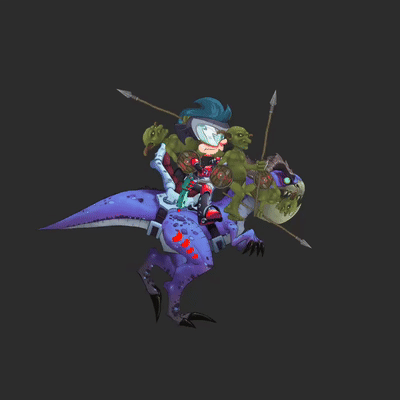

===================================
skeleton:inject()
===================================

| **Type:** ``function``
| **See also:** :doc:`index`, :doc:`injectionEvent`, :doc:`eject`

Overview:
.........

**Injects** a Solar2D display object on top of a given slot. This lets you attach
custom display objects like images, effects or even another skeleton instance to a slot, with a
:doc:`injectionEvent` function that let's you track the slot's transform updates.

If you try re-inserting the same object, it will overwrite the previous one, but if you only want to
update the slot it is attached to, it is recommended to use the :doc:`changeInjectionSlot <changeInjectionSlot>` function instead.

.. note::

    When an object is removed, it is automatically ejected from the skeleton.

Syntax:
--------

.. fragment: syntax line; object, slotName and listener are placeholders
.. code-block:: lua

   skeleton:inject(object, slotName, listener)

- ``object`` *(required)*:
    ``displayObject`` – The Solar2D display object to attach.
- ``slotName`` *(required)*:
    ``string`` – The slot to which the object will attach.
- ``listener`` *(optional)*:
    ``function`` – Called every time the skeleton draws the object's slot (each :doc:`draw`), and once more
    with ``isVisible = false`` when the slot stops being drawn. See :doc:`injectionEvent` for more details.

The object goes into the skeleton's display group at the slot's place in the draw order. The plugin does not move
it: position it from the listener's event, which is in the skeleton group's coordinates.

Example:
--------

.. code-block:: lua

    local displayObject = display.newRect(0, 0, 20, 20)

    local function listener(event)
        print("Slot:", event.slotName)
        print("Position:", event.x, event.y)
        print("Rotation:", event.rotation)
        print("Scale:", event.xScale, event.yScale)
        print("Alpha:", event.alpha)

        -- Follow the slot's bone
        event.target.x, event.target.y = event.x, event.y
        event.target.rotation = event.rotation
        event.target.isVisible = event.isVisible
    end

    skeleton:inject(displayObject, "hand1", listener)
    skeleton:draw()
