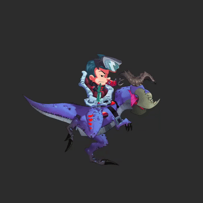

===================================
skeleton:split()
===================================

| **Type:** ``function``
| **See also:** :doc:`index`, :doc:`reassemble`

Overview:
.........
--------

**Splits** a skeleton into a display group containing the slots specified in the table. This lets 
you manipulate the given slots separately from the rest of the skeleton, being useful for some 3D effects.

If you try re-splitting a skeleton, it will overwrite the list of slots, but keep the group intact.

To reassemble the skeleton, use the :doc:`reassemble <reassemble>` function.

Syntax:
--------
--------

.. code-block:: lua

   local splitGroup = skeleton:split(slotNames)

- ``slotNames`` *(required)*:
    ``table`` – A table containing the names of the slots to split.

Return Value:
-------------
-------------

- ``splitGroup``:
    ``displayGroup`` – A display group containing the display objects that were split from the skeleton.

Example:
--------
--------

.. code-block:: lua

    local splitGroup = skeleton:split({"slot1", "slot2", "slot3"})

    -- Move the split group
    splitGroup.x = 100
    splitGroup.y = 100

    -- Insert the split group into the scene
    sceneGroup:insert(splitGroup)